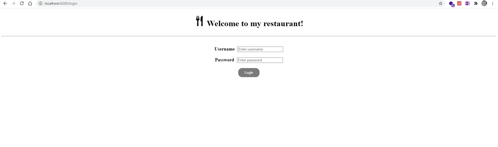
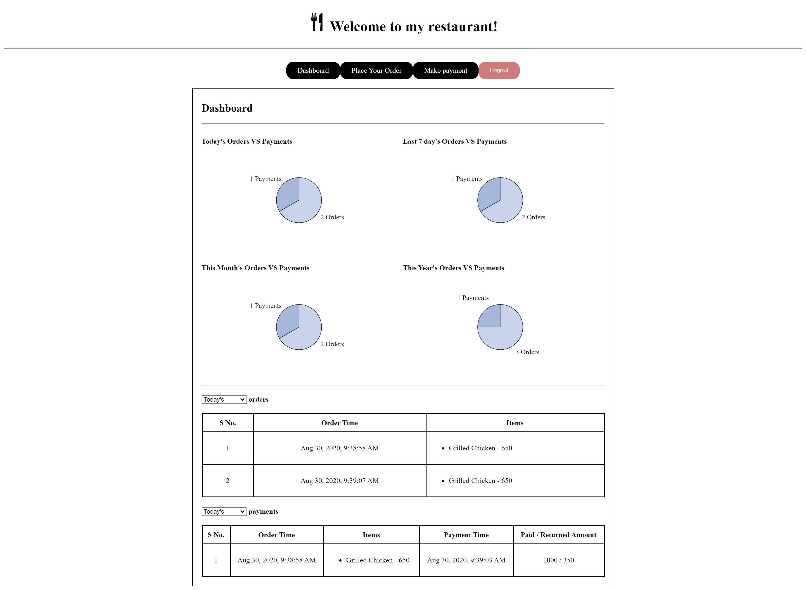
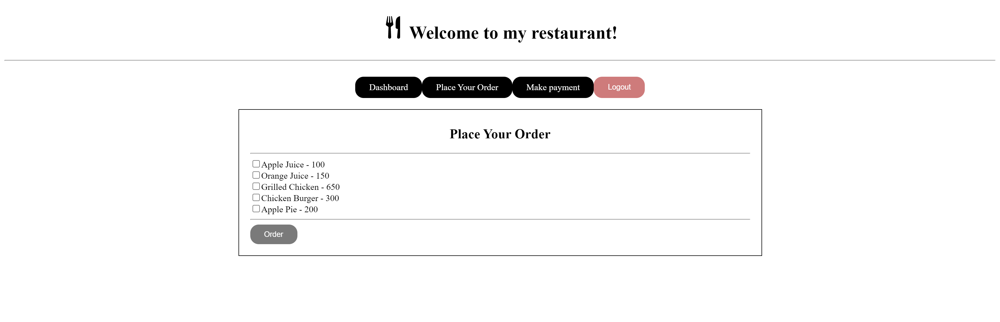
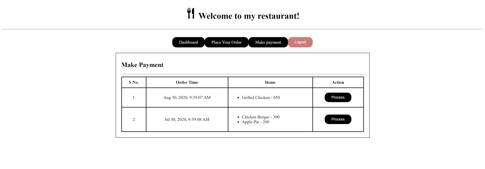
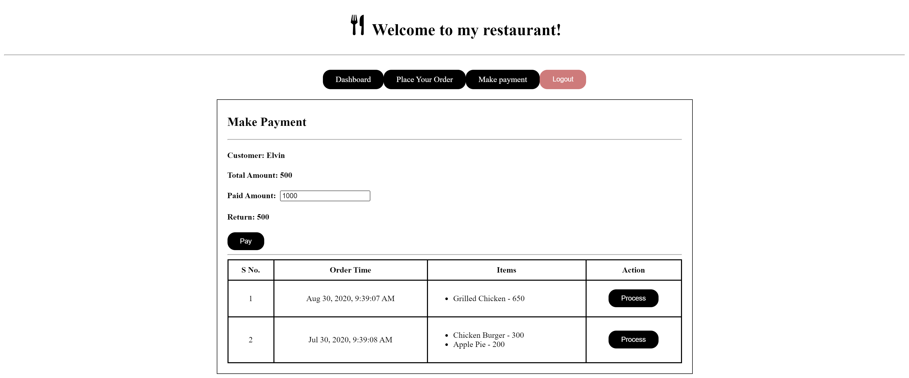
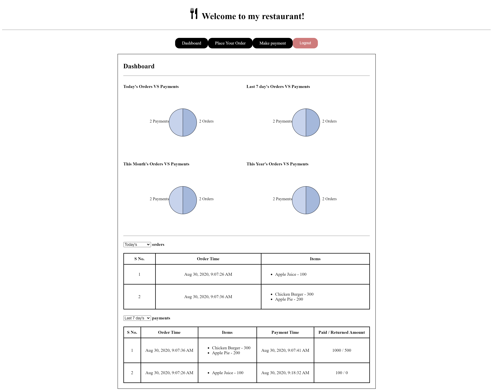

# Restaurant Management System - Angular Frontend

This project was generated with [Angular CLI](https://github.com/angular/angular-cli) version 10.0.8.

---

## Sprint Boot Backend

You can use this [Spring Boot app](https://github.com/elwyncrestha/restaurant-management-system) which provides the APIs that this application consumes.

---

## Components overview

- Login Component\
  

- Dashboard Component\
  

- Order Component
  

- Payment Component
  

- Payment Component Entry
  

- Updated Dashboard Component
  

---

## Video Demo

Find the video [here](images/rms-demo.mp4).
